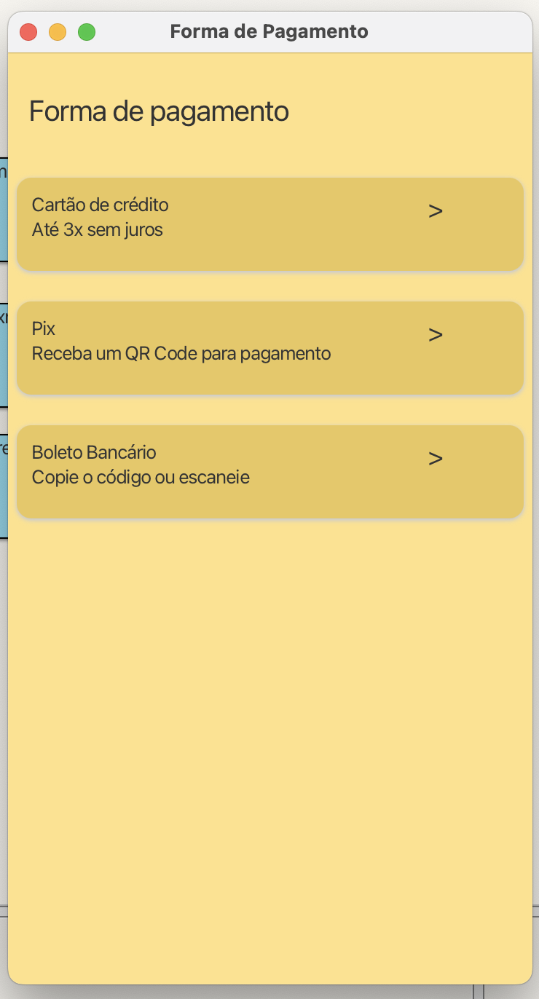

# Marketplace de Plantas

## Objetivo do Projeto
Desenvolver um aplicativo JavaFX que simula um marketplace de compra e venda de plantas, inspirado em plataformas como Mercado Livre e OLX. O projeto permite o cadastro de plantas, a seleção de itens para o carrinho, escolha do método de pagamento e finalização da compra.

## Versão / Data
Versão 1.0 - Julho de 2025  
Projeto em fase de Produto Mínimo Viável (PMV)

## Como Iniciar o Projeto

1. **Pré-requisitos:**
   - Java 17 ou superior
   - JavaFX SDK
   - ORMLite
   - SQLite
   - BlueJ (opcional, usado no desenvolvimento)
   - Scene Builder (para edição dos arquivos `.fxml`)

2. **Clone o repositório:**
   ```bash
   [git clone https://github.com/poo-ec-2025-1/grupo5.git]
Abra o projeto no BlueJ ou IDE de sua preferência.
Execute a classe Main.java para iniciar o aplicativo.

### Autores
* Rodrigo Frota Telles da Silva
* Millena Costa Pimentel
* Letícia Barbosa Taveira Santana


---
## Instruções para o Usuário

### Login
- Tela inicial com botão de login (simulado nesta versão).
- Acesso direto à tela principal após clicar no botão.

### Tela Principal
- Escolha entre cadastrar uma planta para venda ou comprar plantas.

### Cadastro de Plantas
- Permite que o vendedor adicione:
- Nome
- Preço
- Categoria
- Descrição
- Dados são armazenados no banco SQLite via ORMLite.

### Tela de Compra
- Lista todas as plantas disponíveis no banco.
- O usuário pode:
- Selecionar plantas
- Adicionar ao carrinho

### Finalizar compra
- Endereço de Entrega: escolha entre usar um endereço salvo ou inserir novo.
- Forma de Pagamento:
- Pix
- Cartão de Crédito
- Confirmação de Pagamento: após confirmar, o app exibe uma tela de “Compra Finalizada”.

## Funcionalidades Futuras (melhorias)
- Sistema real de login com persistência no banco.
- Histórico de compras por usuário.
- Upload de imagens das plantas.
- Cancelamento ou edição de pedidos.
- Tela de gerenciamento para o vendedor.

## Imagens do Projeto

### Tela de Login


### Tela Principal


### Cadastro de Plantas


### Tela de Compra


### Endereço de Entrega


### Tela de Forma de Pagamento


### Pagamento via Pix


### Compra Finalizada


## Estrutura de Pastas (resumida)

/model  
    Planta.java  
    SessaoCompra.java  
    PlantaRepositorio.java
    
/controller  
    LoginController.java  
    CadastroPlantaController.java  
    CompraController.java  
    EnderecoDeEntregaController.java  
    FormaDePagamentoController.java  
    PixController.java  
    CartaoDeCreditoController.java  
    CompraFinalizadaController.java
    
/view  
    Login.fxml  
    TelaPrincipal.fxml  
    CadastroPlanta.fxml  
    Compra.fxml  
    EnderecoDeEntrega.fxml  
    FormaDePagamento.fxml  
    Pix.fxml  
    CartaoDeCredito.fxml  
    CompraFinalizada.fxml  

### Observações:

O projeto segue a arquitetura MVC com JavaFX + FXML.
Banco de dados: SQLite, gerenciado por uma classe Database.
Persistência via ORMLite.


