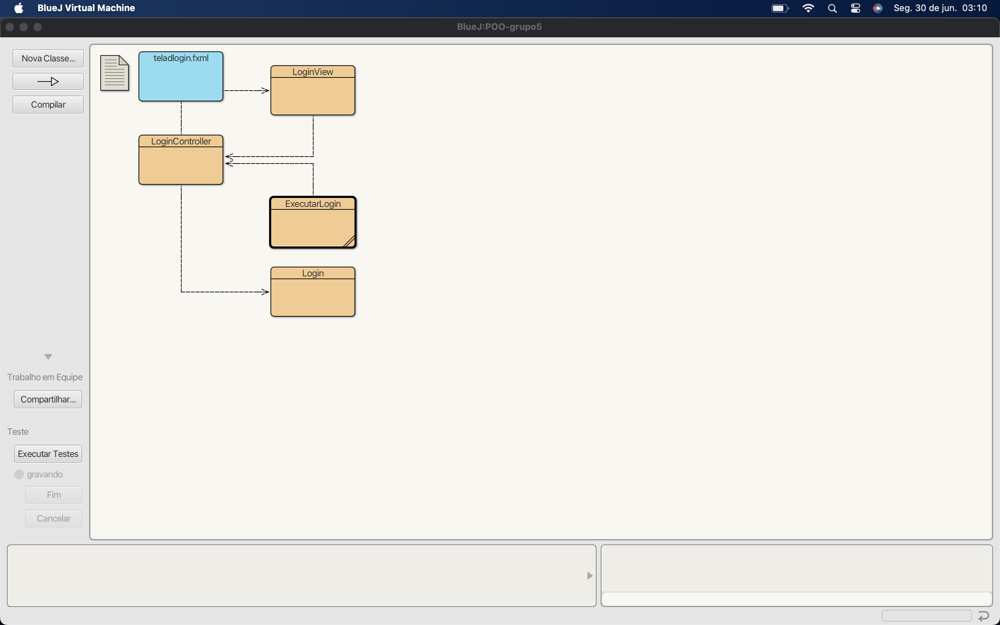
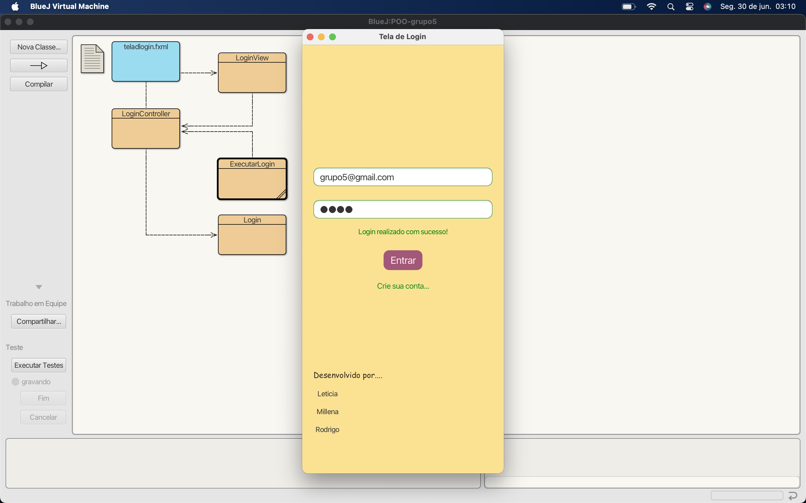

# Prints de tela - Tela de Login

## Diagrama do Projeto no BlueJ

Este print mostra a **estrutura das classes no BlueJ** para o projeto de login.

O diagrama inclui as seguintes classes:
- `ExecutarLogin`: classe principal que inicia a aplicação
- `Login`: representa o modelo com os dados de acesso
- `LoginView`: responsável pela parte visual (interface do usuário)
- `LoginController`: responsável por controlar as interações entre a view e o modelo
- `telalogin.fxml`: arquivo de layout do JavaFX criado com Scene Builder, utilizado na construção da tela

------------
## Funcionamento da Tela de Login

Neste print vemos a **interface gráfica da tela de login** desenvolvida em Java com JavaFX (Scene Builder) e BlueJ.
Esta tela representa a interação visual do usuário com o sistema.

